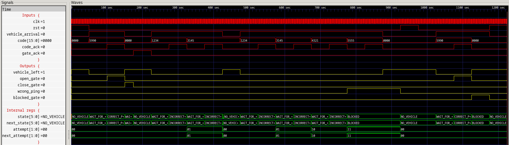

# Tarea \# 1 - IE0523

## Descripción conductual de un controlador automatizado para la entrada de un estacionamiento.

Esta guía proporciona los pasos necesarios para compilar y simular un controlador automatizado para la entrada de un estacionamiento en el lenguaje de descripción de hardware Verilog. 

## Requisitos

<details><summary><b>Mostrar instrucciones</b></summary>

* git
    ```bash
    sudo apt install git
    ```
* make
    ```bash
    sudo apt install make
    ```
* iverilog
    ```bash
    sudo apt install iverilog
    ```
* gtkwave
    ```bash
    sudo apt install gtkwave
    ```
* latexmk
    ```bash
    sudo apt install latexmk
    ```
* pdflatex 
    ```bash
    sudo apt install pdflatex
    ```

</details>

## Uso
### Compilación

<details><summary><b>Mostrar instrucciones</b></summary>

1. Clona el repoistorio:
    ```bash
    https://github.com/Roger-505/tareas-ie0523
    ```

2. Navega al directorio `src`:
    ```bash
    cd tareas-ie0523
    ```

3. Genera la simulación:
    ```bash
    make clean wave
    ```

4. Navega al directorio `informe`:
    ```bash
    cd ../informe
    ```

5. Genera la documentación:
    ```bash
    make
    ```

</details>

### Simulación 
<details><summary><b>Mostrar instrucciones</b></summary>

Después de compilar el código fuente, se desplegará una ventana de `gtkwave` con las formas de onda de la simulación. 

<center>



</center>

</details>

---
